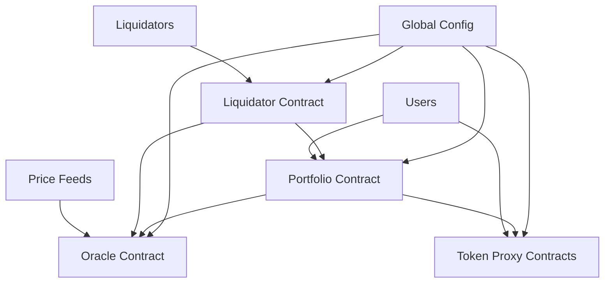

Creda Finance is built on a modular architecture of CosmWasm smart contracts deployed on Cosmos-based blockchains. This design provides security, upgradeability, and composability while maintaining the core lending protocol functionality.

## Contract Architecture



## Core Contracts

### 1. Global Config (`util-global-config`)

**Central Registry and Governance**

The global config contract serves as the central registry and governance hub:

- **Contract Registry**: Stores addresses of all protocol contracts
- **Ownership Management**: Controls administrative functions across contracts
- **Parameter Storage**: Global protocol parameters and settings
- **Upgrade Coordination**: Manages contract upgrades and migrations

**Key Responsibilities:**

- Register and update contract addresses
- Manage protocol ownership and admin rights
- Store global configuration parameters
- Coordinate multi-contract operations

### 2. Portfolio Contract (`creda-portfolio`)

**Core Lending Logic**

The portfolio contract implements all core lending functionality:

- **Supply Operations**: Deposit assets as collateral
- **Borrow Operations**: Take loans against collateral
- **Repay Operations**: Repay borrowed assets
- **Withdraw Operations**: Remove supplied assets
- **Liquidation Logic**: Automated liquidation system
- **Health Monitoring**: Real-time position health tracking

**Key Features:**

- Virtual amount system for gas efficiency
- Isolation mode for risky assets
- Efficiency mode for correlated assets
- Dynamic interest rate calculations
- Multi-asset collateral support

### 3. Oracle Contract (`creda-oracle`)

**Price Feed Management**

The oracle contract provides reliable price data:

- **Price Aggregation**: Combines multiple price sources
- **EMA Smoothing**: Exponential moving average price smoothing
- **Validation Logic**: Price staleness and sanity checks
- **Asset Categories**: Different handling for major/stable/longtail assets
- **Admin Controls**: Emergency price overrides and circuit breakers

**Price Categories:**

- **Major**: LUNA, ATOM - minimal smoothing
- **Stable**: USDC, USDT - tight validation ranges
- **LongTail**: Smaller tokens - enhanced smoothing
- **LP**: Liquidity provider tokens - special calculations

### 4. Token Proxy Contracts (`creda-token-proxy`)

**Asset Representation**

Each supported asset has a token proxy contract:

- **CW20 Interface**: Standardized token interface
- **Balance Tracking**: User balance management
- **Transfer Logic**: Secure asset transfers
- **Allowance System**: Third-party spending approvals
- **Metadata Storage**: Token name, symbol, decimals

**Per-Asset Deployment:**

- One proxy contract per supported asset
- Spawned during asset initialization
- Manages all user balances for that asset
- Integrates with portfolio contract for operations

### 5. Liquidator Contract (`creda-liquidator`)

**Liquidation Automation**

Handles the liquidation process:

- **Position Monitoring**: Tracks unhealthy positions
- **Liquidation Execution**: Performs actual liquidations
- **Bonus Distribution**: Distributes liquidation bonuses
- **Slippage Protection**: Manages price impact during liquidations
- **Integration**: Works with portfolio and oracle contracts

## Technical Design Patterns

### Virtual Amount System

Creda uses a virtual amount system for efficient interest accrual:

```rust
// Virtual amounts don't change over time
struct AssetState {
    supply_vtotal: Uint128,   // Total virtual supply
    borrow_vtotal: Uint128,   // Total virtual borrow
    supply_index: Decimal,    // Growing supply index
    borrow_index: Decimal,    // Growing borrow index
}

// Real amounts calculated from virtual amounts
real_supply = supply_vtotal * supply_index
real_borrow = borrow_vtotal * borrow_index

// User operations convert between real and virtual
vamount_to_deposit = amount / supply_index  // Ceiling division
vamount_to_borrow = amount / borrow_index   // Ceiling division
```

**Benefits:**

- **Gas Efficiency**: No need to update all user balances
- **Compound Interest**: Interest compounds automatically
- **Scalability**: Supports unlimited users without gas concerns
- **Precision**: Maintains high precision for interest calculations

### Interest Rate Models

Assets use piecewise-linear interest rate curves:

```rust
struct InterestRateCurvePoint {
    utilization: Decimal,     // 0.0 to 1.0
    rate_per_year: Decimal,   // Annual rate
}

// Example curve for LUNA
vec![
    InterestRateCurvePoint { utilization: Decimal::percent(0), rate_per_year: Decimal::percent(2) },
    InterestRateCurvePoint { utilization: Decimal::percent(80), rate_per_year: Decimal::percent(10) },
    InterestRateCurvePoint { utilization: Decimal::percent(100), rate_per_year: Decimal::percent(200) },
]
```

**Utilization-Based Rates:**

- Low utilization → Low rates (encourage borrowing)
- Optimal utilization (70-80%) → Moderate rates
- High utilization → High rates (encourage repayment)

### Isolation Mode

Risk management for volatile assets:

```rust
struct AssetConfig {
    isolation: Option<IsolationConfig>,
    // ... other config
}

struct IsolationConfig {
    // Per-asset borrow caps
    borrow_caps: Vec<BorrowCap>,
    // Total borrow cap across all assets
    total_borrow_cap: Option<Uint128>,
}

struct BorrowCap {
    asset_info: AssetInfo,
    cap: Uint128,
}
```

**Isolation Rules:**

- Isolated assets can only be supplied alone
- Individual caps per borrowable asset
- Total cap across all borrowed assets
- Automatic enforcement in portfolio contract

### Efficiency Mode (EMode)

Enhanced capital efficiency for correlated assets:

```rust
struct EmodeGroup {
    ltv: Decimal,                    // Higher LTV for group
    liquidation_threshold: Decimal,   // Liquidation threshold
    assets: Vec<AssetInfo>,          // Allowed assets
}

// User's EMode status
struct Portfolio {
    emode_group: Option<String>,     // Active group name
    // ... other fields
}
```

**EMode Benefits:**

- Higher borrowing capacity (e.g., 93% vs 70% LTV)
- Only available when supplying group assets only
- Automatic activation/deactivation
- Risk managed through asset correlation

## Security Features

### Access Control

Multi-level permission system:

```rust
// Contract-level permissions
struct Config {
    owner: Addr,           // Full admin rights
    emergency_owner: Addr, // Emergency functions only
}

// Function-level access control
#[execute]
pub fn update_asset_config(
    deps: DepsMut,
    info: MessageInfo,
    config: AssetConfigUpdate,
) -> Result<Response, ContractError> {
    // Only owner can update asset config
    let config = CONFIG.load(deps.storage)?;
    if info.sender != config.owner {
        return Err(ContractError::Unauthorized {});
    }
    // ... update logic
}
```

### Input Validation

Comprehensive validation at all entry points:

```rust
pub fn validate_supply_amount(amount: Uint128) -> Result<(), ContractError> {
    if amount.is_zero() {
        return Err(ContractError::InvalidAmount { amount });
    }
    // Additional validation logic
    Ok(())
}

pub fn validate_asset_info(asset_info: &AssetInfo) -> Result<(), ContractError> {
    match asset_info {
        AssetInfo::NativeToken { denom } => {
            if denom.is_empty() {
                return Err(ContractError::InvalidAsset {});
            }
        }
        AssetInfo::Token { contract_addr } => {
            deps.api.addr_validate(contract_addr)?;
        }
    }
    Ok(())
}
```

### Reentrancy Protection

State management prevents reentrancy attacks:

```rust
// Use of stateful caching prevents reentrancy
pub struct StateCache<'a> {
    storage: &'a mut dyn Storage,
    asset_states: HashMap<AssetInfo, AssetState>,
    dirty: HashSet<AssetInfo>,
}

impl<'a> StateCache<'a> {
    pub fn get_asset_state_mut(&mut self, asset_info: &AssetInfo) -> Result<&mut AssetState, ContractError> {
        // Load from storage only once
        if !self.asset_states.contains_key(asset_info) {
            let state = ASSET_STATES.load(self.storage, asset_info)?;
            self.asset_states.insert(asset_info.clone(), state);
        }
        self.dirty.insert(asset_info.clone());
        Ok(self.asset_states.get_mut(asset_info).unwrap())
    }

    pub fn save_asset_changes(self) -> StdResult<()> {
        // Save all dirty states atomically
        for asset_info in self.dirty {
            let state = self.asset_states.get(&asset_info).unwrap();
            ASSET_STATES.save(self.storage, &asset_info, state)?;
        }
        Ok(())
    }
}
```

## Contract Interactions

### Cross-Contract Calls

Contracts interact through well-defined interfaces:

```rust
// Portfolio queries oracle for prices
let price_response: PriceResponse = deps.querier.query_wasm_smart(
    oracle_addr,
    &OracleQueryMsg::Price { asset_info: asset_info.clone() }
)?;

// Portfolio updates token proxy balances
let update_balance_msg = CosmosMsg::Wasm(WasmMsg::Execute {
    contract_addr: token_proxy_addr.to_string(),
    msg: to_binary(&TokenProxyExecuteMsg::UpdateBalance {
        user: user_addr.clone(),
        amount: new_balance,
    })?,
    funds: vec![],
});
```

### Event Emission

Standardized event emission for indexing:

```rust
pub fn emit_supply_event(
    asset_info: &AssetInfo,
    user: &Addr,
    amount: Uint128,
    vamount: Uint128,
) -> Attribute {
    Attribute::new("action", "creda-portfolio/supply")
        .add("user", user.as_str())
        .add("asset_info", serde_json_wasm::to_string(asset_info).unwrap())
        .add("amount", amount.to_string())
        .add("vamount", vamount.to_string())
}
```

### Error Handling

Structured error types for better debugging:

```rust
#[derive(Error, Debug)]
pub enum ContractError {
    #[error("{0}")]
    Std(#[from] StdError),

    #[error("Unauthorized")]
    Unauthorized {},

    #[error("Insufficient collateral: need {need}, have {have}")]
    InsufficientCollateral { need: Uint128, have: Uint128 },

    #[error("Asset borrow cap exceeded: asset {asset_info}, cap {cap}, requested {requested}")]
    AssetBorrowCapExceeded {
        asset_info: AssetInfo,
        cap: Uint128,
        requested: Uint128,
    },

    #[error("Health factor too low: {health_factor}, minimum {minimum}")]
    HealthFactorTooLow {
        health_factor: Decimal,
        minimum: Decimal,
    },
}
```

## Development & Testing

### Testing Framework

Comprehensive testing using `cw-multi-test`:

```rust
use cw_multi_test::{App, ContractWrapper, Executor};

#[test]
fn test_supply_and_borrow() {
    let mut app = App::default();

    // Deploy contracts
    let portfolio_id = app.store_code(portfolio_contract());
    let oracle_id = app.store_code(oracle_contract());

    // Initialize contracts
    let portfolio_addr = app.instantiate_contract(
        portfolio_id,
        Addr::unchecked("owner"),
        &InstantiateMsg { /* ... */ },
        &[],
        "portfolio",
        None,
    ).unwrap();

    // Test supply operation
    let supply_msg = ExecuteMsg::Supply { /* ... */ };
    let res = app.execute_contract(
        Addr::unchecked("user1"),
        portfolio_addr.clone(),
        &supply_msg,
        &coins(1000, "uluna"),
    );

    assert!(res.is_ok());

    // Verify state changes
    let portfolio: PortfolioResponse = app.wrap().query_wasm_smart(
        portfolio_addr,
        &QueryMsg::Portfolio { address: "user1".to_string() }
    ).unwrap();

    assert_eq!(portfolio.supplies.len(), 1);
}
```

### Schema Generation

Auto-generated schemas for integration:

```bash
# Generate JSON schemas for all messages
cargo run --bin schema

# Outputs to api/creda-portfolio/schema/
# - instantiate_msg.json
# - execute_msg.json
# - query_msg.json
# - migrate_msg.json
```

### Code Coverage

Coverage tracking with `tarpaulin`:

```bash
# Run tests with coverage
cargo tarpaulin --target-dir target-tarpaulin --out html lcov

# Generates coverage report
open tarpaulin-report.html
```

## Deployment & Upgrades

### Contract Deployment

```bash
# Build optimized contracts
docker run --rm -v "$(pwd)":/code \
  --mount type=volume,source="$(basename "$(pwd)")_cache",target=/code/target \
  --mount type=volume,source=registry_cache,target=/usr/local/cargo/registry \
  cosmwasm/rust-optimizer:0.12.13

# Deploy to network
terra contract store artifacts/creda_portfolio.wasm \
  --from deployer \
  --gas-prices 0.15uluna \
  --gas auto \
  --gas-adjustment 1.4
```

### Migration Support

Contracts support migration for upgrades:

```rust
#[cfg_attr(not(feature = "library"), entry_point)]
pub fn migrate(deps: DepsMut, _env: Env, msg: MigrateMsg) -> Result<Response, ContractError> {
    let ver = get_contract_version(deps.storage)?;

    // Ensure we're migrating from compatible version
    if ver.contract != CONTRACT_NAME {
        return Err(ContractError::InvalidMigration {
            current_contract: ver.contract,
            current_version: ver.version,
        });
    }

    // Perform migration logic
    match msg {
        MigrateMsg::UpdateConfig { new_config } => {
            CONFIG.save(deps.storage, &new_config)?;
        }
        MigrateMsg::MigrateAssetStates => {
            // Custom migration logic for asset states
            migrate_asset_states(deps.storage)?;
        }
    }

    // Update contract version
    set_contract_version(deps.storage, CONTRACT_NAME, CONTRACT_VERSION)?;

    Ok(Response::new().add_attribute("action", "migrate"))
}
```

This modular smart contract architecture provides the foundation for Creda Finance's secure, efficient, and upgradeable lending protocol on the Cosmos ecosystem.
